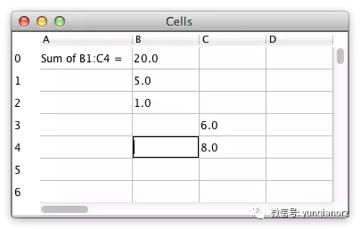

# 7GUIs

https://eugenkiss.github.io/7guis/

7GUIs 是用于验证 GUI 编程的基线，包括 7 个小任务。

- **计数器**，点一次按钮 +1
- **温度转换器**，做摄氏度和华氏度的互转，挑战点是双向数据流
- **机票预定**，支持单程和双程，挑战点是约束，比如选单程不能设置返程日期，比如去的日期必须比回的日期早
- **计时器**，可实时调整时间的时间沙漏，挑战点是并发、race condition 和实时性
- **CURD**，挑战点是数据模型和 UI 分离，
- **Circle Drawer**，用 Canvas 画圆，支持调整直径，挑战点是 undo/undo，绘图和对话框控制
- **单元格**，实现 excel 的简单可用版，支持公式，相对复杂而实际的任务，辅助评估方案是否适合大型应用

jotai 作者最近用 jotai 完成了 7GUIs 的挑战，详见 https://twitter.com/dai_shi/status/1433804219828490241 。
