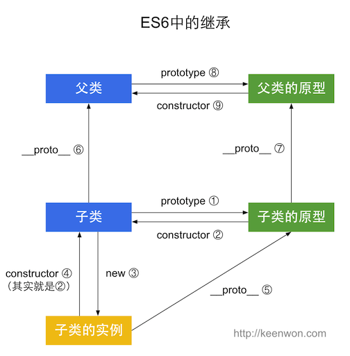

# ES5 和 ES6 中的继承

Javascript 中的继承一直是个比较麻烦的问题，`prototype`、`constructor`、`__proto__`在构造函数，实例和原型之间有的复杂的关系，不仔细捋下很难记得牢固。ES6 中又新增了`class`和`extends`，和 ES5 搅在一起，加上平时很少自己写继承，简直乱成一锅粥。不过还好，画个图一下就清晰了，下面不说话了，直接上图，上代码。

## ES5

ES5 中的继承，看图：


```js
function Super() {}

function Sub() {}
Sub.prototype = new Super()
Sub.prototype.constructor = Sub

var sub = new Sub()

Sub.prototype.constructor === Sub // ② true
sub.constructor === Sub // ④ true
sub.__proto__ === Sub.prototype // ⑤ true
Sub.prototype.__proto__ == Super.prototype // ⑦ true

// ES5中这种最简单的继承，实质上就是将子类的原型设置为父类的实例。
```

## ES6

ES6 中的继承，看图：



```js
class Super {}

class Sub extends Super {}

var sub = new Sub()

Sub.prototype.constructor === Sub // ② true
sub.constructor === Sub // ④ true
sub.__proto__ === Sub.prototype // ⑤ true
Sub.__proto__ === Super // ⑥ true
Sub.prototype.__proto__ === Super.prototype // ⑦ true
```

所以

ES6 和 ES5 的继承是一模一样的，只是多了`class` 和`extends` ，ES6 的子类和父类，子类原型和父类原型，通过`__proto__` 连接。

原文: http://keenwon.com/1524.html

参考：

- https://www.myfreax.com/javascript-prototype-chain-pattern/
