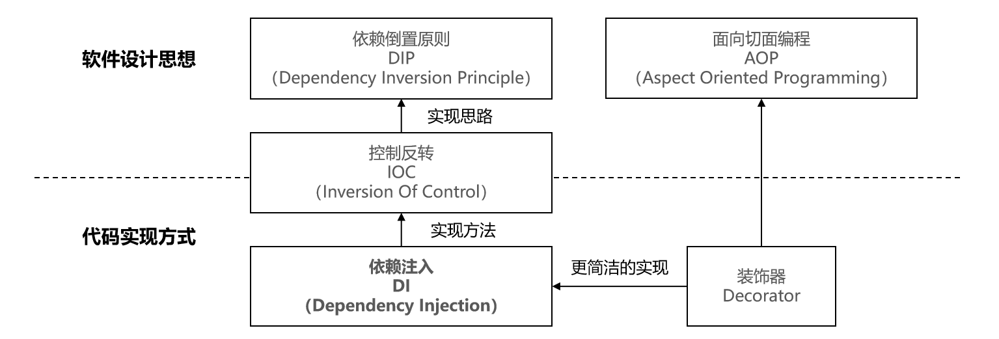

# IOC

- [要搞清楚 IoC ，那就用 TS 手写一个！](https://mp.weixin.qq.com/s/GXv7JwBbJ0b_AUMvZ8C1QQ)
- reflect-metadata
- inversify

## 控制反转

- IOC（控制反转）是一种编程思想，可以解耦组件，提高组件复用性。
- DI（依赖注入）

### IOC与DI的关系

DI是实现IOC编程思想的一种方式。

除了DI外，另一种实现方式是Dependency Lookup（依赖查找），简称DL。

相关仓库

- [power-di](https://github.com/zhang740/power-di)
- [InversifyJS](https://www.npmjs.com/package/inversify)

## 依赖为什么需要注入

依赖注入（Dependency Injection，简称DI）并不算一个复杂的概念，但想要真正理解它背后的原理却不是一件容易的事情，它的上游有更加抽象的IOC设计思想，下游有更加具体的AOP编程思想和装饰器语法，只有搞清楚整个知识脉络中各个术语之间的联系，才能够建立相对完整的认知，从而在适合的场景使用它，核心概念的关系如下图所示：

## IOC-vs-AOP

参考:

- https://zhuanlan.zhihu.com/p/141204279
- [使用IOC解耦React组件](https://www.jianshu.com/p/3c9371e180e7)
