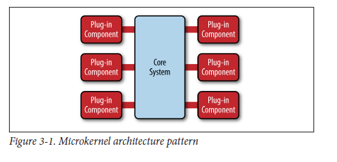

# 插件系统设计

微内核架构模式（有时被称为插件架构模式）是实现基于产品应用程序的一种自然模式。

微内核系统架构模式由两块组成：核心系统和插件系统。应用逻辑分为独立的插件模块和基本核心模块，继而有扩展性、灵活性同时隔离应用程序功能和处理特定事物逻辑。

核心模块只拥有能使应用运行的最小功能逻辑。许多操作系统使用微内核系统架构，这就是该结构的名字由来。从业务应用的角度，核心系统通常定义了一般商务逻辑，不包含特殊情况、特殊规则、复杂的条件的特定处理逻辑。

插件模块是独立存在的模块，包含特殊的处理逻辑、额外的功能和定制的代码，能拓展核心系统业务功能。通常，不同的插件模块互相之间独立，但是你可以设计成一个插件依赖于另外一个插件的情况。最重要的是，你需要让插件之间的互依赖关系降低到最小，为避免繁杂的依赖问题。

很多库、工具实现都能见到插件化的影子，我们结合实例深入了解下

> 在这里我用的是**插件（plugin）**这个词，有时也被称做是**扩展（extensions）**，**附加组件（add-ons）**或 **模块（modules）**。无论叫什么名字，概念都是一样的。

插件分类

- event-plugin
- inject-plugin

常见的插件化开发实现

- [jQuery](https://learn.jquery.com/plugins/basic-plugin-creation/)
- Webpack
- Babel
- Eslint
- Postcss
- [Vue2](https://vuejs.org/v2/guide/plugins.html)
- [Vue3](https://v3.vuejs.org/guide/plugins.html)
- koa
- Egg
- Rollup
- [Gatsby](https://www.gatsbyjs.com/docs/creating-plugins/)
- Vite
- Umi 微内核
- vscode
- SpringBoot

究其本质，插件化大致分为以下几类

- 约定/注入插件化
- 事件插件化 √
- 插槽插件化

小考验：常见的插件化实现属于上面哪一类？

我们这里整理一些常见的实现，以供参考使用，还有一些考虑点

- 稳定性：插件隔离
- 性能：插件激活，插件都是懒加载的，实现上是插件注册特定激活事件

看一下 chrome 和 vscode 的插件机制，总结一下一个健壮的插件系统应该具备的几点核心特性：

1. 控制插件的加载
2. 对插件暴露合适范围的上下文，并对不同场景的上下文做隔离
3. 有一套可插拔的消息通信机制，订阅&监听

直接实现一个 VS Code 或者 Chrome 有点困难，所以本文以实现一个简单的 CLI 插件系统为例，讲解如何实现一个简单的插件系统。

其他：

- TODO: https://github.com/unjs/unplugin
- [《软件架构模式》-第三章 微内核系统结构](https://ifeve.com/%E3%80%8A%E8%BD%AF%E4%BB%B6%E6%9E%B6%E6%9E%84%E6%A8%A1%E5%BC%8F%E3%80%8B-%E7%AC%AC%E4%B8%89%E7%AB%A0-%E5%BE%AE%E5%86%85%E6%A0%B8%E7%B3%BB%E7%BB%9F%E7%BB%93%E6%9E%84/)
- https://css-tricks.com/designing-a-javascript-plugin-system/
  - 译文[怎样设计一个 JavaScript 插件系统](https://segmentfault.com/a/1190000030697262)
- [【第 1 期】插件系统的设计](https://zhuanlan.zhihu.com/p/106183037)
- [插件化思维](https://github.com/ascoders/weekly/blob/master/%E5%89%8D%E6%B2%BF%E6%8A%80%E6%9C%AF/53.%E7%B2%BE%E8%AF%BB%E3%80%8A%E6%8F%92%E4%BB%B6%E5%8C%96%E6%80%9D%E7%BB%B4%E3%80%8B.md)
- [从 0 到 1 编写插件系统](https://www.zhihu.com/column/c_1255589339138379776)
- [大型 Web 应用插件化架构探索](https://zhuanlan.zhihu.com/p/357724347)
- [插件式可扩展架构设计心得](https://zhuanlan.zhihu.com/p/372381276)
- [库、插件、组件、控件、扩展](https://www.zhihu.com/question/49536781/answer/117606933)
- [插件化 js 开发](https://blog.csdn.net/wocaonima123987/article/details/8501813)
- [微内核架构模式](https://everfind.github.io/courses/software-architecture/microkernel-architecture.html#%E4%B8%BE%E4%BE%8B%E8%AF%B4%E6%98%8E)
- [微内核架构模式在前端的实践与原则](https://zhuanlan.zhihu.com/p/443982576)

1. 主程序如果希望自身的功能可以被扩展，其需要：
   1. 提供一组服务 (Service Interface)。其提供（约束）了插件对主体能力可控制的边界。服务定义的越精细，插件控制的粒度越小，能力越大，但耦合度和复杂度也越高。
   2. 定义一种扩展契约 (Plug-In Interface)，其描述了插件应该如何设计以便于主程序发现。并通过插件管理模块 (Plug-In Manager) 来发现、维护插件。
2. 插件通过实现主程序规定的扩展契约（通常是一个接口），标明自己的身份，并接收来自主程序的事件响应。通过调动主程序提供的服务，实现和主程序的交互。这一过程，通常都是被主程序以 SDK (Software Development Kit) 的形式封装。

## 插件系统的构成

- **主系统** 使用插件管理器加载插件、创建插件对象，之后的插件对象可以像常规对象一样创建了。
- **插件管理器** 负责插件的加载、初始化、卸载并暴露到主系统中，也提供所有注册对象的获取、迭代以及获取对象的注册信息等。
- **插件** 根据插件系统的规范实现各种接口类（这个规范包括类继承、类注册、DLL 初始化等）
